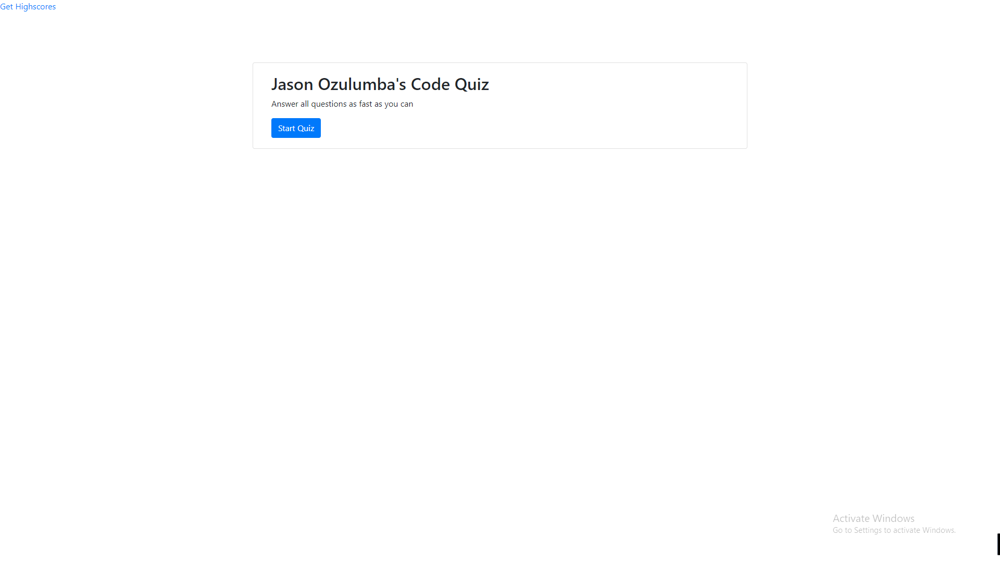

# Test-Your-Knowledge

A Code Quiz to determine how much you know on basic coding knowledge

## Preview

## How to Access

To gain access to the website click [here](https://mbpjason.github.io/Test-Your-Knowledge/)

## What I did 

Tried to make HTML elements via Javascript and post them to certain hard points in my html file. Then remove them when switching to different sections. It should take user inputs tell them if they are "right or wrong" and then tally up a score and and save it too local storage. It should populate accordingly.